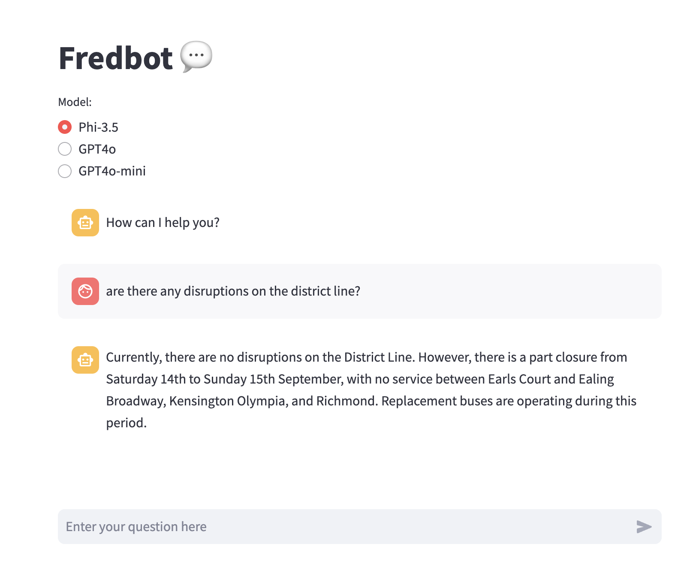

# Fredbot


<br>
This repository includes an early prototype of Fredbot - My AI assistant. This early version of Fredbot is a chatbot that can be powered by a small language model (e.g. **Phi-3**, which can be run via CPU or via an ONNX runtime) or a large language model (e.g. **GPT4o** & **GPT4o-mini**, which require openai api credentials).
<br>

## Installation


- Clone the repository
- Install dependencies
```
pip install -r requirements.txt
```

- Store Openai credentials in a `.env` file

- Run the Streamlit app
```
streamlit run app.py
```

### Using ONNX runtime
The instructions below detail the process of running the Phi3 SLM locally on CPU using the ONNX Runtime generate() API. The model can also be ran using Nvidia Cuda using [these instructions.](https://onnxruntime.ai/docs/genai/tutorials/phi3-python.html#run-with-nvidia-cuda)

- Download the required ONNX model from Huggingface in the `code` directory (Example below) and store the relevant path to the model in as an env variable.
```
huggingface-cli download microsoft/Phi-3-mini-4k-instruct-onnx --include cpu_and_mobile/cpu-int4-rtn-block-32-acc-level-4/* --local-dir .
```

<br>

